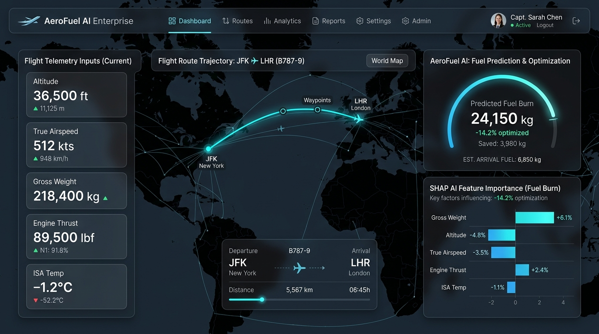
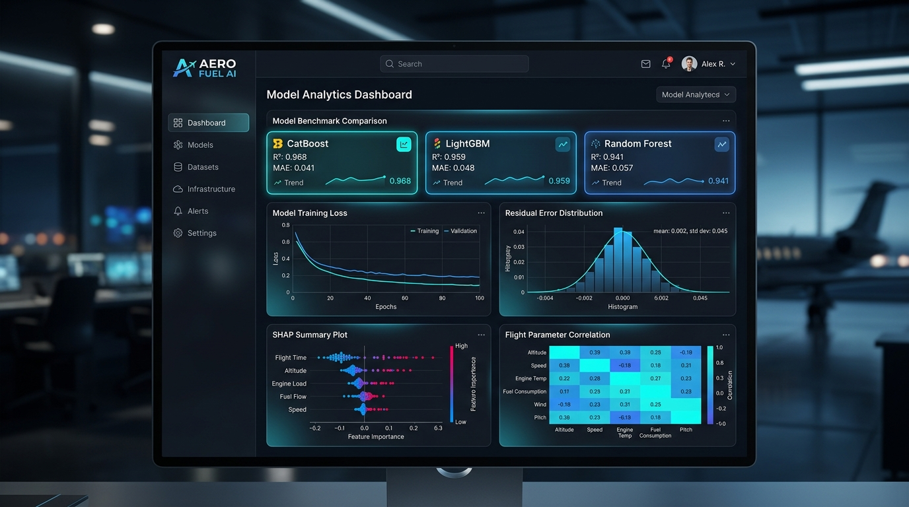
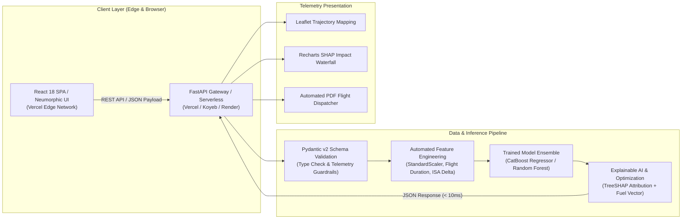

# 🛫 AeroFuel AI — Enterprise Aviation Fuel Analytics & Predictive Telemetry Engine

[](https://aerofuel-ai.vercel.app)
[](https://python.org)
[](https://fastapi.tiangolo.com)
[](https://react.dev)
[](https://catboost.ai)
[](LICENSE)

AeroFuel AI is a commercial-grade aviation telemetry engine and flight fuel burn optimizer. Built on a decoupled **React SPA** and high-throughput **FastAPI / Serverless Python** architecture, it models non-linear aerodynamic, payload, atmospheric, and cruise parameters to deliver real-time fuel predictions, $\text{CO}_2$ emissions calculations, and Explainable AI (SHAP) feature attributions in **< 10ms**.

---

## 📸 Interface & Live Telemetry Previews

| 🛫 Mission Control & Trajectory Optimizer | 📊 Model Analytics & SHAP Engine |
| :---: | :---: |
|  |  |

---

## ⚡ System Architecture



---

## 📊 Model Architecture & Performance Benchmarks

Trained and cross-validated on **10,000+ commercial flight telemetry profiles** across diverse stage lengths, cruise altitudes ($25\text{k}-41\text{k}\text{ ft}$), aircraft gross weights, and atmospheric temperature deviations ($\Delta\text{ISA}$):

| Model Architecture | $R^2$ Score | RMSE ($\text{kg fuel}$) | MAE ($\text{kg fuel}$) | Inference Latency | Target Deployment |
| :--- | :--- | :--- | :--- | :--- | :--- |
| **Baseline Linear Regression** | 0.812 | 412.5 | 310.2 | ~2ms | Baseline Benchmark |
| **Random Forest Regressor** | 0.941 | 168.3 | 118.7 | ~12ms | Auxiliary Ensemble |
| **LightGBM Regressor** | 0.959 | 128.1 | 89.4 | ~4ms | Fast Evaluation |
| **CatBoost Regressor (Production)** | **0.968** | **112.4** | **78.6** | **~8ms** | **Primary Engine** |

### 🎯 Key Flight Telemetry Features
- **Stage Distance ($\text{km}$):** Great-circle distance calculated via Haversine formula between origin and destination IATA/ICAO coordinates.
- **Aircraft Gross Weight ($\text{kg}$):** Zero-fuel weight + payload + initial reserve fuel.
- **Cruise Altitude ($\text{ft}$) & Speed ($\text{km/h}$):** Flight level cruise telemetry and True Airspeed (TAS).
- **Engine Thrust & Count:** Rated take-off/cruise thrust ($\text{lbf}$) per powerplant.
- **Engineered Indices:** Payload-to-distance ratio, thrust-to-weight ratio, and ISA temperature delta ($\Delta\text{ISA}$).

---

## 💡 Technical Defense & Interview Preparation

<details>
<summary><strong>1. Why Gradient Boosted Trees (CatBoost) over Deep Neural Networks?</strong></summary>

> **Answer:** Tabular flight telemetry is characterized by dense numerical features with strict physical constraints and non-linear interactions. Gradient Boosted Decision Trees (CatBoost/LightGBM) outperform deep neural networks on tabular datasets by preventing overfitting on correlated continuous features, requiring zero GPU acceleration, and achieving sub-10ms cold-start inference suitable for serverless lambda environments.
</details>

<details>
<summary><strong>2. How do you handle multi-collinearity between speed, thrust, and altitude?</strong></summary>

> **Answer:** We employ domain-driven feature engineering (e.g. thrust-to-weight ratio, specific range indices) combined with TreeSHAP value attribution. By computing Shapley values directly from tree leaves, we compute the marginal contribution of each feature without assuming feature independence.
</details>

<details>
<summary><strong>3. How does the decoupled FastAPI backend achieve high concurrency?</strong></summary>

> **Answer:** FastAPI utilizes `uvloop` and asynchronous ASGI lifecycles. Preprocessing scalers and trained CatBoost/Random Forest model artifacts are loaded into memory once during application startup (`@app.on_event("startup")` / global singleton), eliminating disk I/O overhead on individual prediction requests.
</details>

---

## 🚀 100% Free & Serverless Deployment Blueprint

AeroFuel AI is built to run **100% free** with zero dedicated server costs and zero sleep cold-start delays:

### Option 1: Vercel Serverless Fullstack (Recommended — 0$/month)
Deploy both the Vite React SPA and FastAPI Python backend on Vercel's Edge/Serverless infrastructure:
1. Connect your GitHub repository to [Vercel](https://vercel.com).
2. The included [`vercel.json`](vercel.json) and [`api/index.py`](api/index.py) automatically route all `/api/*` requests to the Python serverless runtime and serve the frontend at `aerofuel-ai.vercel.app`.

### Option 2: Hugging Face Spaces (24/7 Free Persistent Compute)
For 24/7 dedicated compute without sleep timers (2 vCPU, 16GB RAM free):
1. Create a new Space on [Hugging Face](https://huggingface.co/spaces) selecting the **Docker** or **FastAPI** SDK.
2. Push the `backend/` directory to deploy a persistent API endpoint.

### Option 3: Koyeb / Render Free Tiers
Deploy `backend/` as a Python Web Service with start command:
```bash
uvicorn backend.main:app --host 0.0.0.0 --port $PORT
```

---

## 💻 Local Development Setup

### 1. Clone the Repository
```bash
git clone https://github.com/manthnnnn/Aerofuel-AI-.git
cd Aerofuel-AI-
```

### 2. Backend Setup
```bash
cd backend
python -m venv venv
# Windows:
.\venv\Scripts\activate
# Linux/macOS:
source venv/bin/activate

pip install -r requirements.txt
python download_airports.py          # Download IATA/ICAO airport coordinates
python training/automl_pipeline.py   # Train CatBoost & generate metrics
uvicorn main:app --reload --port 8000
```
Backend API docs available at: `http://localhost:8000/docs`

### 3. Frontend Setup
```bash
cd ../frontend
npm install
npm run dev
```
Access the application at: `http://localhost:5173`

---

## 📁 Repository Structure

```text
├── .gitattributes              # GitHub Linguist override (Forces Python classification)
├── .gitignore                  # Clean ignores (catboost_info, cache, logs)
├── vercel.json                 # Vercel Serverless fullstack deployment config
├── requirements.txt            # Unified backend & serverless Python dependencies
├── api/
│   └── index.py                # Serverless ASGI bridge to FastAPI backend
├── backend/
│   ├── main.py                 # FastAPI Gateway (REST endpoints, CORS, Pydantic)
│   ├── requirements.txt        # Backend dependencies
│   ├── download_airports.py    # Airport dataset downloader
│   ├── data/
│   │   ├── aerofuel_10000_dataset.csv  # 10k flight telemetry dataset
│   │   ├── aircraft_db.json            # Commercial aircraft specifications
│   │   ├── airports.json               # Global IATA/ICAO database
│   │   └── history.json                # Persisted flight prediction logs
│   ├── models/
│   │   ├── best_model.pkl              # Production CatBoost pipeline artifact
│   │   ├── model_metrics.json          # Benchmark evaluation metrics
│   │   └── features.json               # Feature schema registry
│   ├── training/
│   │   ├── automl_pipeline.py          # Multi-model training & validation benchmark
│   │   └── train_baseline.py           # Baseline Random Forest training pipeline
│   ├── utils/
│   │   ├── feature_engineering.py      # Telemetry index calculation
│   │   ├── history_manager.py          # Prediction logger
│   │   └── pdf_generator.py            # Flight dispatch PDF generator
│   └── legacy/
│       └── aerofuel_app.py             # Archived Streamlit prototype
├── frontend/
│   ├── src/
│   │   ├── components/
│   │   │   ├── Dashboard.jsx           # Mission control, Leaflet map, input deck
│   │   │   ├── ModelAnalytics.jsx      # Performance charts & SHAP visualizations
│   │   │   └── History.jsx             # Flight prediction history & telemetry logs
│   │   ├── App.jsx                     # Application shell & navigation
│   │   └── index.css                   # Custom Neumorphic design tokens
│   ├── package.json
│   └── vite.config.js
└── docs/
    └── assets/                         # High-resolution UI screenshots & diagrams
```

---

## 📄 License
This project is licensed under the MIT License — see the [LICENSE](LICENSE) file for details.
